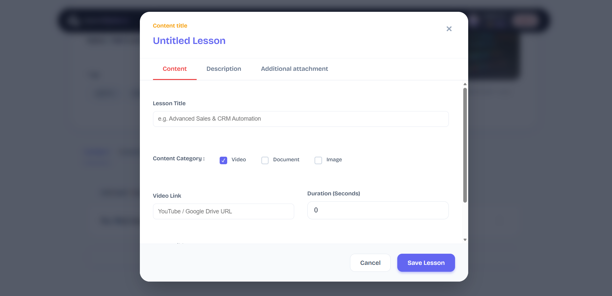
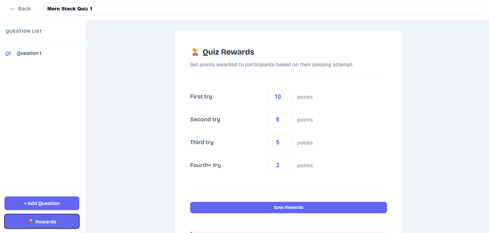
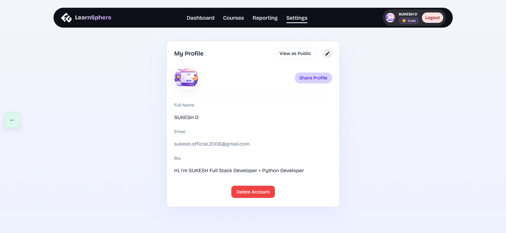
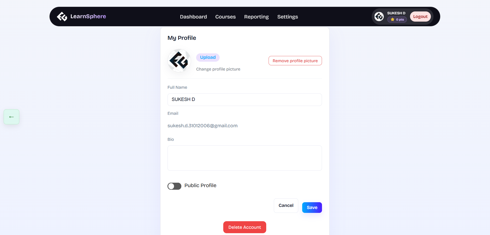

## OUTPUTS:
1. Organizer/Admin/Backend View










2. Participant/ Portal/ Front-End View




## Clone the Repository

```bash
git clone https://github.com/sukeshofficial/LearnSphere.git .
````

---

## Backend Setup

Navigate to the backend folder:

```bash
cd backend
```

Install dependencies:

```bash
npm install
```

Create a `.env` file in the `backend/` directory:

```env
PORT=5000

JWT_SECRET=<your_JWT_secret>
JWT_EXPIRES_IN=1d

DB_HOST="localhost"
DB_PORT=5432
DB_USER="<your_db_user>"
DB_PASSWORD="<your_db_password>"
DB_NAME="<your_db_name>"

EMAIL_USER=<your_email_user>
EMAIL_PASS=<your_email_pass>
FRONTEND_URL=http://localhost:5173
```

Run the backend:

```bash
npm run dev
```

Backend will start on `http://localhost:5000`

---

## Frontend Setup

Open a new terminal and navigate to the frontend folder:

```bash
cd frontend
```

Install dependencies:

```bash
npm install
```

Run the frontend:

```bash
npm run dev
```

Frontend will start on `http://localhost:5173`

---

## Author

**Name:** Sukesh D </br>
**Email:** [sukesh.official.2006@gmail.com](mailto:sukesh.official.2006@gmail.com)</br>
**LinkedIn:** [https://www.linkedin.com/in/sukeshd/](https://www.linkedin.com/in/sukeshd/)

---
